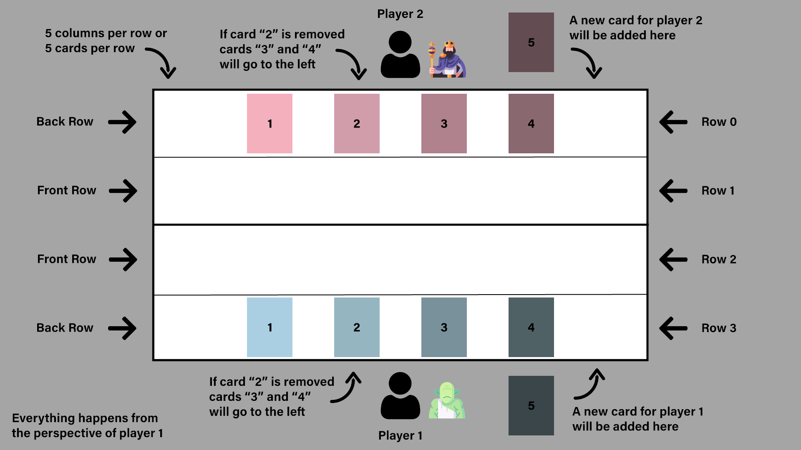

[![MIT License][license-shield]][license-url]
![Homework][homework-shield]

<!-- PROJECT LOGO -->
 

  

<h3 align="center">Gwentstone</h3>

  

    First Object Oriented Programming homework, a 1v1 card game inspired by Hearthstone.
     
     
    <a href="https://github.com/miron-boiangiu/gwentstone/issues">Report Bug</a>
    ·
    <a href="https://github.com/miron-boiangiu/gwentstone/issues">Request Feature</a>
  

<!-- TABLE OF CONTENTS -->

  
Table of Contents

  <ol>
    <li>
      <a href="#about-the-project">About The Project</a>
      <ul>
        <li><a href="#built-with">Built With</a></li>
      </ul>
    </li>
    <li>
      <a href="#getting-started">Getting Started</a>
      <ul>
        <li><a href="#prerequisites">Prerequisites</a></li>
      </ul>
    </li>
    <li><a href="#usage">Usage</a></li>
    <li><a href="#license">License</a></li>
    <li><a href="#contact">Contact</a></li>
  </ol>

<!-- ABOUT THE PROJECT -->
## About The Project

Coded in Java, this project is a base for a card game in which players build their decks and fight 1v1, in a turn-based system. I say base because it lacks an interface implementation, this is basically just the back-end.

<a href="https://ocw.cs.pub.ro/courses/poo-ca-cd/teme/tema">Assignment link.</a>

(<a href="#top">back to top</a>)

### Built With

* [Java](https://www.java.com/en/)

(<a href="#top">back to top</a>)

<!-- GETTING STARTED -->
## Getting Started

### Prerequisites

* A JDK version ([OpenJDK](https://openjdk.org/)/[Oracle JDK](https://www.oracle.com))
* [Lombok](https://projectlombok.org/)
* [Jackson](https://github.com/FasterXML/jackson)

Note: both Lombok and Jackson have a version included in the repository.

### Compilation

I recommend using a build system to compile the source to bytecode and run it:
* [Maven](https://maven.apache.org/)
* [Gradle](https://gradle.org/)

(<a href="#top">back to top</a>)

<!-- USAGE EXAMPLES -->
## Usage

As of right now, the project supports simulating an entire game between two players, from the perspective of one of them. The inputs of both players are read from a JSON file and executed if valid.

The game supports custom decks, with 11 types of cards being implemented so far, 8 minion cards and 3 environment cards. The players also have to choose a hero, having 4 to choose from.

Cards are not all equal, some having special abilities or being tanks (if the opponent has a tank on the table, it has to be destroyed before being allowed to attack other cards or the opponent's hero).

Heroes also have special abilities they can play if they have enough mana.

Exact card values are avoided because they can change frequently from game updates.

General game rules:
* Players can play new cards if they have enough mana to do so
* Both players get a new card everytime the second player's turn ends
* Both players get increased mana everytime the second player's turn ends
* A player can end a turn at anytime
* Minions that have been played can attack once per turn
* Environment cards don't stay on the table (aren't minions), but can have an effect for the cost of mana
* Heroes can use their special ability once per turn, if they have enough mana to do so
* The game ends when one of the heroes reaches 0 health

Current minion cards:
* Sentinel
* Berserker
* Goliath (Tank)
* Warden (Tank)
* Miraj (Special ability)
* The Ripper (Special ability)
* Disciple (Special ability)
* The Cursed One (Special ability)

Current environment cards:
* Firestorm
* Winterfell
* Heart Hound

Current heroes to choose from:
* Lord Royce
* Empress Thorina
* King Mudface
* General Kocioraw

Note: In case you find anything unclear or too vague, please consult the assignment link and README_OLD.md .

 

(<a href="#top">back to top</a>)

<!-- LICENSE -->
## License

Distributed under the MIT License. See `LICENSE.txt` for more information.

(<a href="#top">back to top</a>)

<!-- CONTACT -->
## Contact

Boiangiu Victor-Miron - miron.boiangiu@gmail.com

Project Link: [https://github.com/miron-boiangiu/gwentstone](https://github.com/miron-boiangiu/gwentstone)

(<a href="#top">back to top</a>)

<!-- MARKDOWN LINKS & IMAGES -->
<!-- https://www.markdownguide.org/basic-syntax/#reference-style-links -->
[contributors-shield]: https://img.shields.io/github/contributors/miron-boiangiu/gwentstone.svg?style=for-the-badge
[contributors-url]:https://github.com/miron-boiangiu/gwentstone/graphs/contributors
[forks-shield]: https://img.shields.io/github/forks/miron-boiangiu/gwentstone.svg?style=for-the-badge
[forks-url]:https://github.com/miron-boiangiu/gwentstone/network/members
[stars-shield]: https://img.shields.io/github/stars/miron-boiangiu/gwentstone.svg?style=for-the-badge
[stars-url]:https://github.com/miron-boiangiu/gwentstone/stargazers
[issues-shield]: https://img.shields.io/github/issues/miron-boiangiu/gwentstone.svg?style=for-the-badge
[issues-url]:https://github.com/miron-boiangiu/gwentstone/issues
[license-shield]: https://img.shields.io/github/license/miron-boiangiu/gwentstone.svg?style=for-the-badge
[license-url]:https://github.com/miron-boiangiu/gwentstone/blob/main/LICENSE
[linkedin-shield]: https://img.shields.io/badge/-LinkedIn-black.svg?style=for-the-badge&logo=linkedin&colorB=555
[linkedin-url]: https://linkedin.com/in/miron-boiangiu
[product-screenshot]: images/screenshot.png
[homework-shield]: https://img.shields.io/badge/UPB-Homework-%23deeb34?style=for-the-badge

